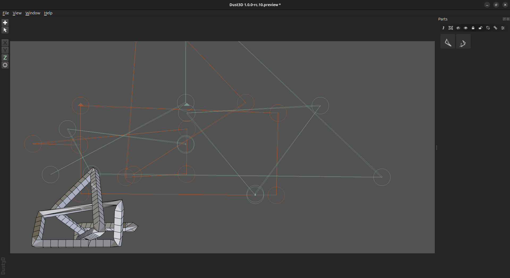

# Dust3D




Dust3D is a cross-platform 3D modeling software that makes it easy to create low poly 3D models for video games, 3D printing, and more.

## Getting Started

These instructions will get you a copy of the Dust3D up and running on your local machine for development and testing purposes.

### Prerequisites

In order to build and run Dust3D, you will need the following software and tools:

- Qt
- Visual Studio 2019 (Windows only)
- GCC (Linux only)

#### Windows

1. Download and install the `Qt Online Installer`
2. Run the installer and choose the Qt archives you want to install (required: qtbase, qtsvg)
3. Install Visual Studio 2019

#### Linux

1. Install Qt using your distribution's package manager (e.g. `apt-get install qt5-default libqt5svg5-dev` on Ubuntu)

### Building

A step by step series of examples that tell you how to get a development environment running

1. Clone the repository
```
git clone https://github.com/huxingyi/dust3d.git
```

2. Build using qmake

#### Windows

1. Open the Qt Creator IDE
2. Select "Open Project" from the File menu
3. Navigate to the project directory `dust3d/application` and open the `.pro` file
4. Select the desired build configuration (e.g. Debug or Release) from the dropdown menu at the bottom left of the window
5. Click the "Run" button to build and run the project

#### Linux

1. Change to the project directory  `dust3d/application`
2. Run `qmake` to generate a Makefile
3. Build the project using `make`

### Releasing

1. Make sure all changes are merged to master branch including CHANGELOGS update
2. Run `git tag 1.0.0-rc.<number>`
3. Run `git push origin 1.0.0-rc.<number>`
4. Wait Actions/release finish and download all the Artifacts
5. Goto `Tags/1.0.0-rc.<number>` and create release from tag
6. Title the release as `1.0.0-rc.<number>`
7. Copy description from CHANGELOGS
8. Drag the Artifacts: `dust3d-1.0.0-rc.<number>.zip`, `dust3d-1.0.0-rc.<number>.AppImage (Extracted)`, `dust3d-1.0.0-rc.<number>.dmg (Extracted)` to binaries.
9. Publish release

## License

Dust3D is licensed under the MIT License - see the [LICENSE](https://github.com/huxingyi/dust3d/blob/master/LICENSE) file for details.

<!-- Sponsors begin --><!-- Sponsors end -->